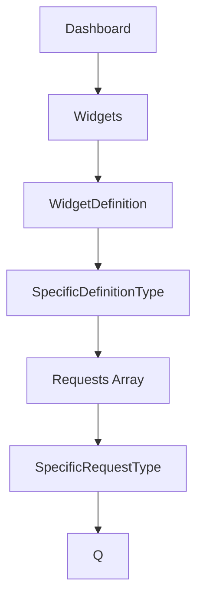

# Datadog Utils
_A Go library for Devops to retrieve important information from Datadog components_

## Moving Parts & Functions

### Files:
* `datadog_api.go` -- Imports the Datadog API client, & handles the API calls
* `helpers.go`     -- A home for helper functions that allow us to work through some of the idiocyncracies in Datadog's API
* `main.go`        -- Self-explanatory. It takes all the user inputs & calls all the things.
---
### Helper Functions:
* `CheckIgnoredWidgetDefs` -- Iterates through a known list (as of 11-May 2021) of `WidgetDefinition` that we do _not_ care about and that do not have the `Requests` array (or do not have the `Q` within `Requests`)
* `SearchWidgetExpressionsArray` -- Iterates through `[]string` and checks whether a string is contained within each `string`
    * Takes two arguments:
        - `expressionsArray` -- Pointer to a `[]string`
        - `searchStr` -- `string` that will be used in the search
    * We just use `strings.Contains()` for the search, but using this helper allows us to target an entire dashboard's array of expressions at once.
---
### Non-Helper Functions:
* `createApiClient()` -- Called on init(), creates an instance of *datadog.APIClient that we can reuse across API-related methods. Returns:
    * APIClient
    * context (type -- `context.Context`)
* `FindMetric()` -- Performs a series of steps to fetch all dashboards, all widgets within each dashboard, and every string expression therein.
    * Takes a single argument: `string` metric (what we're searching for)
    * Returns a `map[string][]string`.  Each key is the dashboardID, and the value is an array composed of strings: all of the expressions that contain a hit against the metric we searched for.
    * We concurrently fetch each dashboard object's Widgets array, and asynchronously iterate through each dashboard's widgets to retrieve the expressions.
    * Then, we [also concurrently] iterate through each dashboard's expressions to see if the metric name is contained therein
* `GetDashboards()`   -- Retrieves a list of all dashboards in Datadog, and returns a map of dasboard ID's, with a nested map containing the following for each:
    * dashboard Title
    * dashboard Author
    * dashboard Last Modified
* `GetDashboardDetails()` -- Takes a single dashboard ID (in `string` format) and fetches info for that dashboard.
    * Returns `map[string]string`
    * The map contains:
        - `Author`
        - `ID` (dashboard ID)
        - `URL`
        - `Widgets` (a count of the number of widgets within the dashboard)
* `GetWidgetExpressions()` -- Takes a pointer to an array of `datadog.Widget` type, and will extract Expressions. These are string representations of the individual queries used in some widgets (like Timeseries).
    * Expressions are self-explanatory.  These are the `q` portion within each `request` in the widget JSON (you can see those in Datadog)
    * Each of the above is stored in a map with the widget ID as the key, mapped to an array of either the expression string, or the requests type.

---
### Example Usage
```
❯ go run datadog_utils --help
Usage of /var/folders/9d/w68r5sdd787gg_1djyk7jmkm0000gp/T/go-build1368975407/b001/exe/datadog_utils:
  -dash-details string
    	String: Get details for a specific dashboard by ID
  -dash-list
    	Bool: will list all DataDog dashboard IDs
  -find-metric string
    	String: Search our DataDog dashboards for the provided metric name to see if it is in use
```

1. `--find-metric` -- `go run datadog_utils --find-metric="server.response.sent"`
    Example output looks like this:
```
{
  "fzi-6va-aag": [
    "sum:<metric_name>{TAGS,$provider,$environment} by {status-code}.as_count()",
    "sum:<metric_name>{TAGS}}.as_count()*100"
  ],
  "n43-std-5sh": [
    "sum:<metric_name>{TAGS}}.as_count()",
    "sum:<metric_name>{TAGS}}.as_count()"
     ]
}
{
  "Author": "goober@imaginary.com",
  "ID": "fzi-6va-aag",
  "URL": "/dashboard/<dashboardID>/some-dashboard-thing",
  "Widgets": "6"
}
{
  "Author": "other-goober@imaginary.com",
  "ID": "n43-std-5sh",
  "URL": "/dashboard/<dashboardID>/some-dashboard-thing",
  "Widgets": "25"
}
```

2. `--dash-details` -- `go run datadog_utils --dash-details="abc-n3k-26j"
```
Here are the high-level details: 
{
  "Author": "goober@imaginary.com",
  "ID": "abc-n3k-26j",
  "URL": "/dashboard/<dashboardID>/some-dashboard-name",
  "Widgets": "14"
}`
```

3. `--dash-list` -- `go run datadog_utils --dash-list`
* I'm not dumping output here, because it's massive and includes ALL dashboards.

---
## Additional References & Documentation
* [Datadog API documentation](https://pkg.go.dev/github.com/DataDog/datadog-api-client-go/api/v1/datadog#section-documentation)
* [Dashboard Struct Breakdown](https://github.com/DataDog/datadog-api-client-go/blob/v1.0.0-beta.20/api/v1/datadog/model_dashboard.go#L17)
* [Widget Struct Breakdown](https://pkg.go.dev/github.com/DataDog/datadog-api-client-go/api/v1/datadog#Widget)
---
### Hierarchy of Datadog Dashboard (As Related to Fetching Expressions in Widgets)
_Note:_ `WidgetDefinition` actually is a `struct` that contains every definition type.  Datadog just adds `nil` to the ones _not_ applicable to a specific widget.  You can [see all of them here](https://pkg.go.dev/github.com/DataDog/datadog-api-client-go/api/v1/datadog#WidgetDefinition), but ultimately this implementation is what necessitated the need for the `CheckIgnoredWidgetDefs` helper function.  Each widget definition has its own Request Type.  You can see `GetWidgetExpressions()` how we fetch the various parts of the Widget & nested info.

---
## Changelog
2021 - May 19 -- Initial Completion, for personal convenience / use
